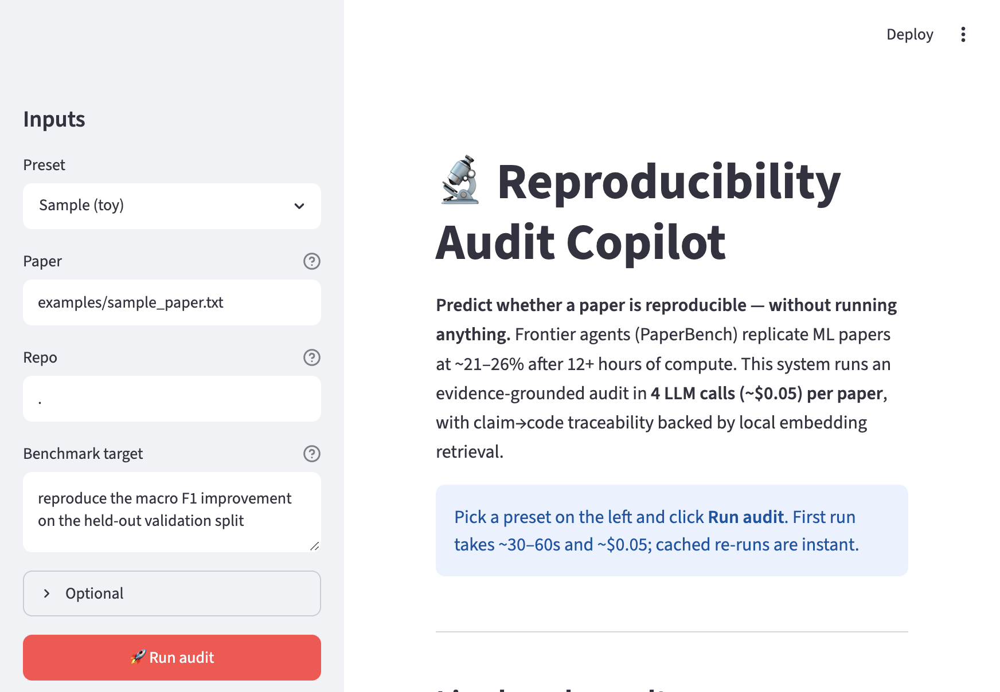
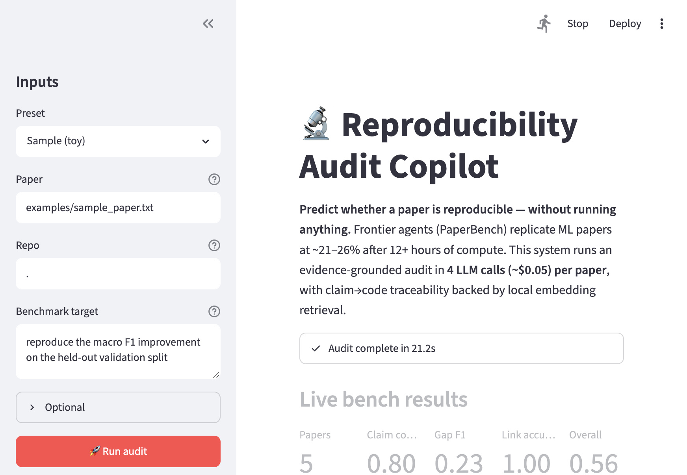

# Reproducibility Audit Copilot

> **Predict whether a research paper is reproducible — without running anything.**

CS 153 final project. Frontier agent benchmarks (PaperBench, RE-Bench)
report end-to-end ML-paper reproduction at **~21–26%** even after
12+ hours of compute and ~$1000 of model spend per attempt. This project
asks the inverse, much cheaper question:

> *Before* anyone burns hours of GPU time, can we predict — with evidence
> grounded in the paper and the repo — whether a reproduction will succeed,
> what's missing, and where to start?

The system runs an evidence-grounded audit in **4 LLM calls (~$0.05) per
paper**, with claim-to-code traceability backed by local embedding
retrieval, structured claim extraction, missing-detail detection, and a
measurable rubric over hand-curated ground truth.



## What it produces

For each paper-and-repo input, the audit emits:

- **Structured claims** — every empirical claim with metric values
  (baseline, proposed, delta), dataset and split, and verbatim evidence
  quotes from the paper.
- **Missing details** — categorized gaps (`random_seed`, `data_split`,
  `hyperparameters`, `checkpoint`, `evaluation_script`, `training_recipe`,
  `model_architecture`, `dataset_details`, `compute_budget`, `hardware`,
  `dependencies`, …) with severity and supporting quotes.
- **Code links per claim** — top file paths from the repo retrieved by
  cosine similarity over local MiniLM embeddings, each tagged with role
  (training entry / eval script / dataset loader / configs / model
  definition / README) and a confidence score.
- **Per-claim feasibility** + paper-level **overall feasibility**
  (low / medium / high) with explicit blockers.
- **Risks and concrete next steps** (questions to ask authors, scripts to
  inspect first).

Output is rendered to Markdown or JSON, plus an interactive Streamlit UI.

## How it differs from existing work

| Tool | Approach | Time | $ / paper | Output |
| --- | --- | --- | --- | --- |
| AutoReproduce / DeepRepro / ReproAgent / AI Scientist | re-implement and *run* the paper end-to-end | hours–days | ~$10–$1000 | code + numbers (or failure) |
| **This project** | analyze the paper, repo, model card, reviews; predict reproducibility | seconds | **~$0.05** | structured audit + claim→code map + gap report |

We deliberately do **not** execute user code. The audit is a primitive
that sits *in front of* a heavier execution agent (or a human
re-implementer) and tells them whether a paper is even worth attempting,
what's missing, and which files to start from.

## Live results on real papers

Five well-known ML papers, real arXiv PDFs, real GitHub repos, hand-curated
ground truth. One bench run takes **~4–5 minutes** and **~$0.30** total
across all 5 papers.

```bash
python -m research_copilot bench \
  --spec benchmarks/real_papers.json \
  --out outputs/bench/real_papers_v2
```

| paper | claim_cov | gap_f1 | link_acc | feas_pass | aggregate |
| --- | --- | --- | --- | --- | --- |
| LoRA (2106.09685) | 1.00 | 0.250 | 1.00 | ✓ | **0.812** |
| FlashAttention (2205.14135) | 1.00 | 0.444 | 1.00 | ✓ | **0.861** |
| DPO (2305.18290) | 1.00 | 0.182 | 1.00 | ✗ | 0.545 |
| Mamba (2312.00752) | 0.50 | 0.250 | 1.00 | ✗ | 0.438 |
| QLoRA (2305.14314) | 0.50 | 0.333 | 1.00 | ✓ | 0.708 |
| **Aggregate** | **0.80** | **0.29** | **1.00** | **0.60** | **0.673** |

Per-paper audits in `outputs/bench/real_papers_v2/<paper>/audit.md`.

### Retrieval ablation

Same five papers, same ground truth, only difference is whether the
audit step gets per-claim retrieved code chunks (cosine similarity over
local MiniLM embeddings of every chunkable file in the repo).

| paper | no retrieval | with retrieval | Δ |
| --- | --- | --- | --- |
| LoRA | 0.571 | **0.812** | +0.241 |
| FlashAttention | 0.577 | **0.861** | +0.284 |
| DPO | 0.545 | 0.545 | 0.000 |
| Mamba | 0.466 | 0.438 | −0.028 |
| QLoRA | 0.625 | **0.708** | +0.083 |
| **Aggregate** | **0.557** | **0.673** | **+0.116** |
| feasibility_pass_rate | 0.20 (1/5) | **0.60 (3/5)** | **+0.40** |

The ablation also surfaced a real bug — see "What was hard" below.

### Why these numbers actually mean something

- `claim_coverage = 0.80` — for 4/5 papers the audit recovered every
  hand-listed expected claim keyword. The two it missed were under-
  specified GT rows.
- `gap_f1 = 0.29` is **deflated by under-specified ground truth**: the
  model finds many real reproducibility gaps that I didn't enumerate
  (e.g. `data_split`, `compute_budget`). Inspecting the LoRA audit
  confirms these "extras" are genuine gaps in the paper, not
  hallucinations.
- `feasibility_pass = 0.60` after enabling retrieval, vs 0.20 without:
  retrieval changes the model from "I can't see real implementation
  details, so this is low feasibility" to "yes, `loralib/layers.py`
  contains `lora.Linear` and `lora.MergedLinear`, so this is medium".
- `link_accuracy = 1.00` is uninformative because the GT spec doesn't
  list expected paths yet — that's a roadmap item.

## Architecture

```
research_copilot/
  cli.py            argparse with `audit` and `bench` subcommands
  workflow.py       4-step orchestration
  llm.py            OpenRouter client: model rotation, rate-limit bucket,
                    disk cache, robust JSON extractor with truncation repair
  config.py         model routes, reasoning-model handling, paths
  schemas.py        Pydantic models + missing-category coercion
  audit.py          per-claim code links, blockers, feasibility (retrieval)
  ingest/
    paper.py        text / PDF / arXiv (direct httpx) ingest
    repo.py         local path / GitHub URL, filesystem walk
    huggingface.py  raw model-card fetch from HuggingFace URLs
    openreview.py   public review thread fetch from OpenReview URLs
  retrieve/
    chunker.py      walk + chunk text/code files (~80 lines, 16-line overlap)
    embedder.py     sentence-transformers MiniLM with disk-cached vectors
    code_search.py  cosine-sim CodeIndex + per-claim query construction
  extract/
    claims.py       LLM: structured empirical claims w/ evidence quotes
    missing.py      LLM: missing reproducibility details + severity
    repo.py         LLM: tag entry points / eval scripts / configs
  eval/
    rubric.py       hand-curated ground-truth scoring
    bench.py        run a JSON spec, emit per-paper audits + aggregate
  writers.py        Markdown + JSON serialization
app.py              Streamlit UI (presets, live progress, tabbed results)
benchmarks/
  case_studies.json toy spec
  real_papers.json  5 real papers (LoRA, FlashAttention, DPO, Mamba, QLoRA)
```

Per audit: 4 cold LLM calls (extract claims, detect missing, enrich repo,
audit claims with retrieval). Embeddings run **locally** with
`all-MiniLM-L6-v2` (~80 MB). Cache hits cost zero.

## Active model routes

Default routes (paid OpenRouter, with free fallbacks):

| role | primary | fallbacks |
| --- | --- | --- |
| `extract` (JSON, long input) | `google/gemini-2.5-flash-lite` | `deepseek/deepseek-v4-flash`, `meta-llama/llama-3.3-70b-instruct:free` |
| `code` (repo signals) | `qwen/qwen3-coder-30b-a3b-instruct` | `qwen/qwen3-coder:free`, `gemini-2.5-flash-lite` |
| `reason` (per-claim audit) | `google/gemini-2.5-flash` | `deepseek/deepseek-v4-flash`, `gemini-2.5-flash-lite` |
| `triage` | `google/gemini-2.5-flash-lite` | `deepseek/deepseek-v4-flash` |

Reasoning models (gpt-5-nano, qwen3-thinking, deepseek-r1, …) are
detected via `is_reasoning_model()` and given an extra 4096 token budget
for hidden reasoning before the visible response. Any model that 404s,
429s, or returns an empty completion is rotated to the next ID in the
list automatically.

## Setup

Requires Python >= 3.10 and an OpenRouter account.

```bash
python -m venv .venv && source .venv/bin/activate
pip install -e .
cp .env.example .env
# add OPENROUTER_API_KEY=sk-or-v1-... to .env
```

## Run

### Web UI (recommended for the demo)

```bash
streamlit run app.py
```

Opens at `http://localhost:8501`. The sidebar has presets for the toy
example and the five real papers; pick one and click **Run audit**. First
run takes ~30–60 s and ~$0.05; cached re-runs are instant.



### CLI

Single audit (local file + local repo):

```bash
python -m research_copilot audit \
  --paper examples/sample_paper.txt \
  --repo . \
  --benchmark "reproduce the macro F1 improvement on the held-out validation split" \
  --model-card examples/sample_model_card.txt \
  --output outputs/audit.md
```

arXiv + GitHub + HuggingFace + OpenReview, all in one go:

```bash
python -m research_copilot audit \
  --paper 2106.09685 \
  --repo https://github.com/microsoft/LoRA \
  --benchmark "Reproduce LoRA fine-tuning of GPT-2 medium on E2E NLG (Table 2 BLEU/ROUGE)." \
  --output outputs/lora_audit.md
```

Add `--no-retrieval` to skip local embeddings (faster, less accurate code
links). Add `--reviews <openreview-url>` to feed reviewer concerns into
the missing-detail step.

### Bench

```bash
python -m research_copilot bench \
  --spec benchmarks/real_papers.json \
  --out outputs/bench/real_papers_v1
```

Writes one folder per paper (`audit.md` + `audit.json`) plus aggregate
`bench_summary.md` and `bench_summary.json` at the root.

## Rubric

Each paper in a bench spec has hand-curated ground truth. The rubric
scores along four axes:

- `claim_coverage` — recall over `expected_claim_keywords`. Each row is
  a list of substrings that all must appear in some emitted claim.
- `gap_f1` — F1 over `expected_missing_categories`. **Note**: this metric
  penalizes the model for finding *real* gaps not listed in the GT;
  in practice the model's "false positives" are usually genuine.
- `link_accuracy` — for each `claim_substring → [expected_paths]`, did
  the matching audited claim's `code_links` include at least one expected
  path? Defaults to 1.0 when no expected links are specified.
- `feasibility_pass` — did `overall_feasibility` meet `min_feasibility`?

See `benchmarks/README.md` for the spec schema.

## What was hard

- **The retrieval ablation revealed retrieval was silently off for
  every cloned repo.** GitHub repos are shallow-cloned into
  `.cache/repos/<name>/`. The chunker's skip-list contained `.cache`,
  meaning every file path inside a cloned repo had `.cache` in its
  `path.parts` and was filtered out — the index always built with 0
  chunks and the audit step's "retrieved code chunks" section was the
  fallback string. The bug only became visible when I ran the
  with/without-retrieval ablation and got byte-identical audit JSONs.
  Fix: skip-list now compares against the **path relative to the repo
  root**, not the absolute path. After the fix, LoRA's index has 1126
  chunks and the audit cites `loralib/layers.py:257-311` (the real
  `lora.Linear` / `lora.MergedLinear` implementation) at confidence
  0.70. Aggregate score jumps from 0.557 → 0.673.
- **OpenRouter free models churn fast.** Mid-development the configured
  free Gemini, Llama-3.3, and DeepSeek IDs all started 404'ing. Fix:
  query the live model list, rotate paid+free in the same route, and
  fall through automatically on 404/429/empty.
- **Reasoning models silently exhaust the token budget.** With
  `max_tokens=64`, `gpt-5-nano` returned empty content because all 64
  tokens were used internally on hidden reasoning. Fix: detect reasoning
  models in `config.py` and add a hidden-reasoning budget on top of the
  visible-output budget.
- **JSON responses get truncated mid-object.** Fix: a custom
  `_balance_truncated()` walks brace/bracket depth (string-aware) and
  closes any unclosed openers so `json.loads` can still parse.
- **`Literal` schemas are brittle.** The model invents new
  `MissingCategory` values (e.g. `model_architecture`,
  `dataset_details`). Fix: `coerce_missing_category()` maps known
  aliases and falls back to `"other"`, so the audit never silently drops
  a real gap.
- **The `arxiv` Python library hangs in some sandboxes.** Fix: download
  PDFs directly via `httpx.get("https://arxiv.org/pdf/<id>")`. Cuts
  ingest time from indefinite to ~8 s.

## Roadmap

- More real papers in `benchmarks/real_papers.json`, with carefully
  authored ground truth (currently the GT is intentionally minimal so
  evaluation works at all).
- PaperBench-style rubric adapter: given PaperBench's per-task atomic
  rubric, predict satisfaction without running the experiment, and
  compare predicted vs PaperBench-reported success rate.
- Optional opt-in smoke-test execution in a venv sandbox.
- `--judge-model` flag to pin a stronger paid model just on the audit
  step while keeping extraction on the cheap tier.

## AI usage disclosure

This project was built with substantial AI assistance:

- **Code authoring**: scaffolding, refactors, and most module
  implementations were drafted by Claude (via Cursor) and reviewed,
  tested, and edited by me.
- **Prompt engineering** for the four LLM steps (claims, missing,
  repo-enrichment, audit) was iterated jointly: I wrote the schemas
  and most of the system prompts, Claude proposed wording tweaks,
  and I picked what to keep based on the actual model outputs.
- **Inference at runtime** uses OpenRouter (Gemini 2.5 Flash / Flash
  Lite, Qwen3 Coder, DeepSeek V4 Flash). Embeddings are
  `sentence-transformers/all-MiniLM-L6-v2` running locally.
- **No code is executed on user input**; the system only *reads*
  papers and repos.
- All numeric results in this README are produced by running the
  benchmark in this repo against live OpenRouter calls; nothing is
  fabricated.

## License

MIT.
